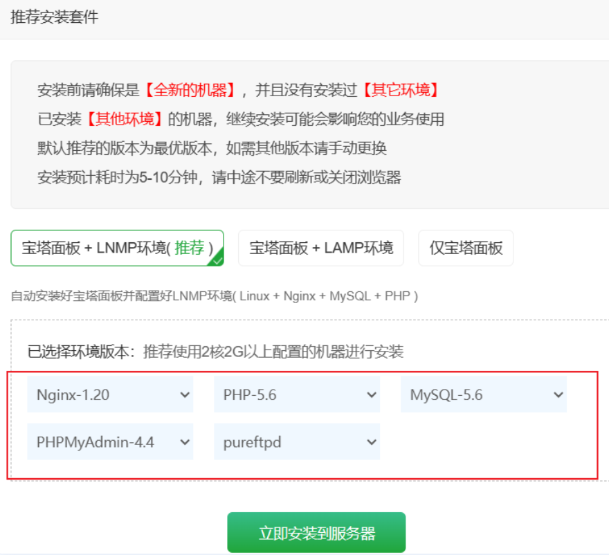
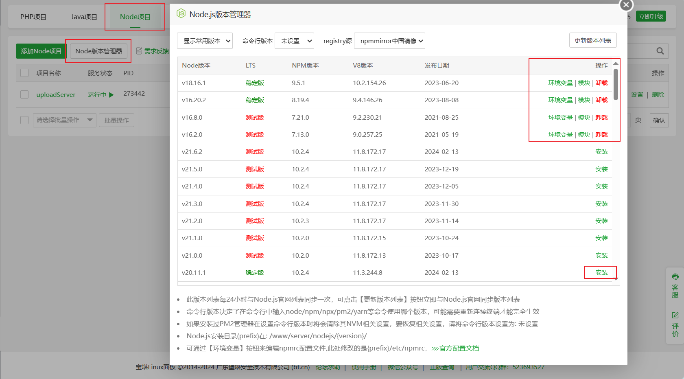
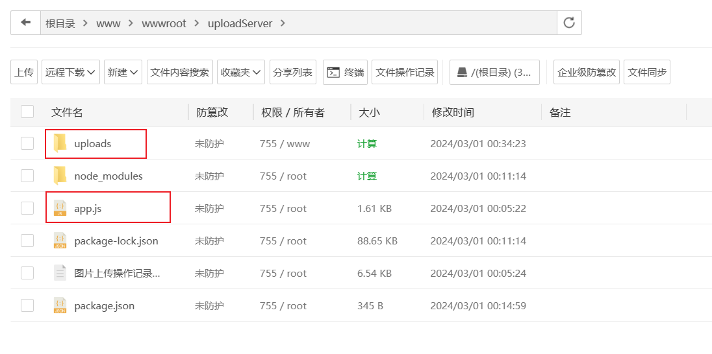

# 将 Node 服务部署到阿里云中 （使用宝塔）

## 为什么选择宝塔

1. 因为搜了很多教程，用 linux 命令装很多包，具体是怎么做的我不清楚，但看阿里云的教程需要下载 yum、nvm、ftp工具等，本来我是打算使用 命令行 挑战一下的，但连 yum 都装不上，阿里云又默认服务器都安装到了，就很服。
2. 后续用宝塔也确实是方便了很多，例如上传文件、安装 nodeJs、安装 pm2、在服务器中启动 node 服务等

3. 实际的操作过程也是比较消耗时间的，总共用时 2h。接下来就详细记录这一过程：

## 详细过程（时间轴）

1. 拿到广州的服务器后，登录宝塔看看之前有没有部署过静态网站，没有的话直接把阿里云的服务器重装了（上网搜教程，很快就找到了）。
2. 重装完后，打开宝塔，连接上服务器后就下载它的那一套套餐。
3. 还折腾了一下为什么 ssh 登录时，密码正确但始终登陆不上，说 permission denied ，后来发现是登录时命令打错了，ssh 登录时需要带上 用户名 ：`ssh -l 用户名 公网IP` 。
4. 期间也通过GPT了解了 ： 需不需要使用数据库存放图片、图片和node服务在一起会有什么影响、数据库服务和Node服务在同一个服务器可以吗、如何在 这种图片上传的服务中接入 Mysql，并且将图片存入数据库、如何新建一个 Get 请求获取对应 数据库中的资源？
   1. 最后 GPT 都给了不错的方案，就等待自己接下来的实践了
   2. 冲！把图片这块弄完下一步就是更新博客、再下一步就是 React-Tato 小程序了！
5. 宝塔安装完后，就记录了它的账户密码。接下来进入宝塔页面，打开【网站】目录，选择 Node ，它就会提示下载 node 版本管理器，即 nvm。安装完后似乎还会下载 pm2，这里我也不是很清楚了~~
6. 之后我就将我本地的 Node 文件的输出 host 改了一下，就是改控制台日志打印而已，其实根本不需要修改都可以的。改完后将文件上传到服务器中新建的一个目录中。
7. 接着在 【网站】 目录中新建 Node 项目，并且填入相关的信息，选择入口文件或者执行的启动命令，注意用户名需要选择 root ，不知道为啥用 www 的用户就不行。
8. 启动起来后，服务就提供着了，此时用 React 项目发起请求也是能够拿到资源，连上传图片都是可以的了！（**注意：** uploads 文件夹要先创建，毕竟是存放图片用的）

## TODO

* Post 请求中，进行一下 **格式校验**，防止传入 非图片文件 遭到网络攻击
* **对 Node 服务进行说明**，后续暂时不再引入：数据库，也只把图片存在 服务器所在位置，并且这个服务只用于博客图片的上传。如果要上传其他杂七杂八的图片，可以写多几个接口，存放在不同的文件夹中。（刚开始还想说开多几个node服务，让前端请求不同端口的接口 :hammer_and_wrench: ​**hhh~**:ear_of_rice:

* 将**前端的服务优化**一下：
  * 实现多个分类的接口服务功能，例如：博客图片、算法博客图片、日常图片等。后端接口可以暂时没有，但前端样式得做出来，用 React
  * React前端中：实现 路径复制 功能，加入 Antd 修改一下前端的样式，以及交互也做好一些。
  * 文件的目录、项目结构进行改造重构，目的快速掌握 React 实践！
* **为后端开发几个新的接口**，前端联调完后双方都进行部署！
* **给 博客 的图片引入进行修改**，尽可能地优化前端图片资源的访问速度以及减轻文件大小
* 接下来继续学习 React 以及 Taro，**开发一个自己的小程序**，同时去熟练看明白 **微信小程序 的官方文档**

## 相关图片

---

---

